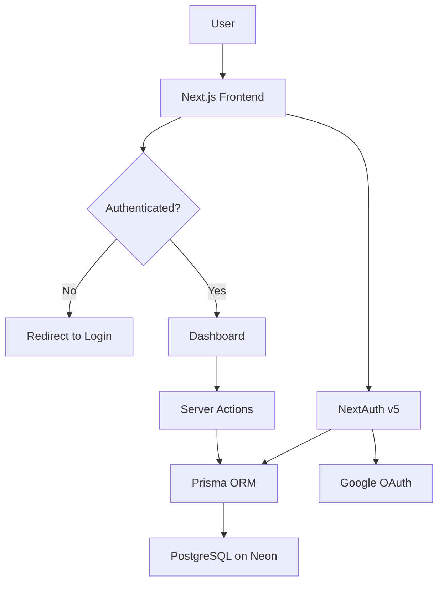

# Job Tracker


A full-stack SaaS application for tracking job applications through every stage of the hiring process.

**Live Demo**: https://job-tracker-henna-gamma.vercel.app

---

## The Problem

Job hunting is chaotic. Applications pile up across different companies, roles, and stages. Most people track this in spreadsheets or don't track it at all. Job Tracker gives you one clean place to manage everything.

---

## Features

- Google OAuth authentication
- Add job applications with company, role, salary, location type, and employment type
- Track application status: Applied, Interview, Offer, Rejected
- Real-time status updates without page reload
- Stats dashboard showing totals across every stage
- Delete applications
- Pro upgrade flow with free tier limit of 10 applications
- Dark mode and light mode toggle
- Protected routes so unauthenticated users are redirected to login
- GitHub Actions CI pipeline with type checking and linting
- Fully deployed and live in production

---

## System Architecture



---

## Performance

Measured via PageSpeed Insights on production.

**Desktop**
- Performance: 100
- Accessibility: 91
- Best Practices: 100
- SEO: 100
- First Contentful Paint: 0.2s
- Largest Contentful Paint: 0.4s
- Total Blocking Time: 0ms

**Mobile**
- Performance: 99
- Accessibility: 91
- Best Practices: 100
- SEO: 100
- First Contentful Paint: 1.1s
- Largest Contentful Paint: 2.0s
- Total Blocking Time: 30ms

---

## Tech Stack

- **Next.js 16** App Router, Server Actions, Server Components
- **TypeScript** end to end type safety
- **PostgreSQL** hosted on Neon
- **Prisma ORM** database access and migrations
- **NextAuth v5** Google OAuth with database sessions
- **Tailwind CSS v4** styling
- **shadcn/ui** component library
- **Docker** containerization with Nginx reverse proxy
- **GitHub Actions** CI pipeline with type checking and linting
- **Vercel** deployment and hosting

---

## Key Engineering Decisions

**Server Actions over API Routes** reduces network overhead and simplifies data flow. Forms submit directly to server functions without a separate API layer.

**Database sessions over JWT** stores sessions in PostgreSQL via the NextAuth adapter. This allows instant session invalidation and avoids token management complexity.

**Middleware route protection** checks authentication at the proxy layer before any page renders, keeping protection logic in one place rather than duplicated across pages.

**Neon serverless PostgreSQL** handles connection pooling via the Neon adapter, solving the serverless cold start problem on Vercel.

---

## Docker

```bash
docker compose up
```

Nginx reverse proxy runs on port 80 and forwards to the Next.js app on port 3000.

---

## Local Development

```bash
git clone https://github.com/prathiusharun/job-tracker
cd job-tracker
npm install
```

Create a `.env` file:

```
AUTH_SECRET=
AUTH_URL=http://localhost:3000
AUTH_GOOGLE_ID=
AUTH_GOOGLE_SECRET=
DATABASE_URL=
```

```bash
npx prisma migrate dev
npm run dev
```

---

## What's Next

- Stripe integration with free tier limited to 10 applications and paid unlimited
- Email reminders for follow-ups
- Analytics including response rate and time to offer
- Export to CSV